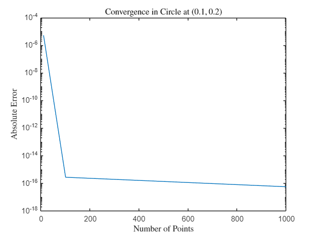
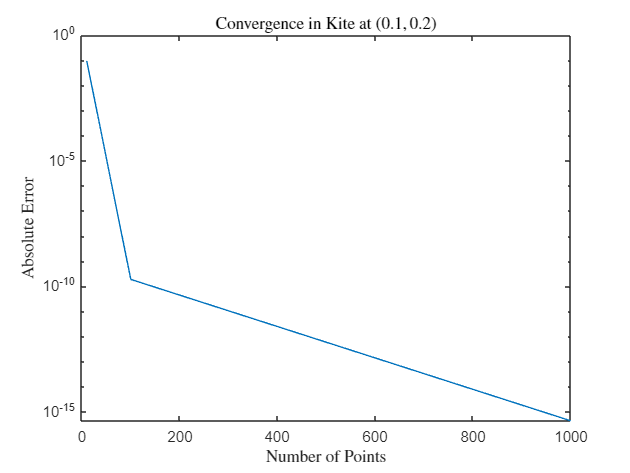
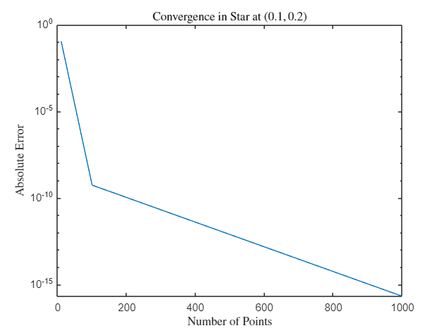
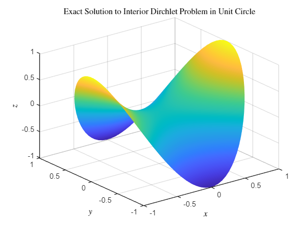

# Nyström Method
This repository contains code for the Nystrom Method pertaining to the interior Dirichlet problem for the Laplace Equation
  
## Theoretical Formulation
  

This notebook presents a simple example of how the Nyström Method can be used towards solving the Laplace Equation when considering a the scatterfield of a wave in the interior of a simple smooth geometry. For concreteness we shall use this method for solving the Dirichlet problem where we impose the condition that along the boundary $\Gamma$

  

$$
u({{\textrm{x}}})=g({{\textrm{x}}}),
$$
  

Note that here ${{\textrm{x}}}$ is a vector given by ${{\textrm{x}}}=\left(x_1 ,x_2 \right)$. All together we have

  

$$
\Delta u\left({{\textrm{x}}}\right)=0,\:\:{{\textrm{x}}}\in \Omega ,
$$
> with                                            

$$
u({{\textrm{x}}})=g({{\textrm{x}}}),\:\:\forall {{\textrm{x}}}\in \Gamma
$$
  

For this problem, we use the double layer potential integral formulation of the solution. This is given by:

  

$$
u\left({{\textrm{x}}}\right)=D\left\lbrack \varphi \right\rbrack \left({{\textrm{x}}}\right)=\int_{\Gamma } G({{\textrm{x}}},{{\textrm{y}}})\varphi ({{\textrm{y}}})ds({{\textrm{y}}})
$$
  

where $G\left({{\textrm{x}}},{{\textrm{y}}}\right)$ is the Green's function in free space and $\varphi$ satisfies the following relation:

  

                                                
$$
\frac{\varphi (x)}{2}+\int_{\Gamma } G({{\textrm{x}}},{{\textrm{y}}})\varphi ({{\textrm{y}}})ds({{\textrm{y}}})=g\left({{\textrm{x}}}\right)\;\;\;{{\textrm{x}}}\in \Gamma
$$                                          
$$
[2]
$$
  

It is known that the kernel $G\left({{\textrm{x}}},{{\textrm{y}}}\right)$ for this problem is given by 

  

$$
G\left({{\textrm{x}}},{{\textrm{y}}}\right)=\textrm{K}\left({{\textrm{x}}},{{\textrm{y}}}\right):=-\frac{\left({{\textrm{x}}}-{{\textrm{y}}}\right)\cdot \nu \left({{\textrm{y}}}\right)}{2\pi {\left|{{\textrm{x}}}-{{\textrm{y}}}\right|}^2 }
$$
  

It is also known that this kernel is continuous along a boundary that is twice continuously differentiable, meaning that in the specified geometry $\textrm{K}\left({{\textrm{x}}},{{\textrm{y}}}\right)$ has a removable singularity at ${{\textrm{x}}}={{\textrm{y}}}$. Thus, at such points we can assign $\textrm{K}\left({{\textrm{x}}},{{\textrm{y}}}\right)=\lim_{{{\textrm{x}}}\to {{\textrm{y}}}} \textrm{K}\left({{\textrm{x}}},{{\textrm{y}}}\right)$

  

We see that if we parametrize ${{\textrm{x}}}$ and ${{\textrm{y}}}$ as:

  

$$
{{\textrm{x}}}={{\textrm{r}}}(s)=\left(u(s),\:v(s)\right)
$$
> and                                                

$$
{{\textrm{y}}}={{\textrm{r}}}(t)=\left(u(t),\:v(t)\right)
$$
  

We get that  $\textrm{K}\left({{\textrm{x}}},{{\textrm{y}}}\right)=\tilde{\textrm{K}} (s,t):=\frac{-\left(u(s)-u(t)\right)v\prime (t)+\left(v(s)-v(t)\right)u\prime (t)}{2\pi \left|{{\textrm{r}}}\prime \left(t\right)\right|{\left|{{\textrm{r}}}\left(s\right)-{{\textrm{r}}}\left(t\right)\right|}^2 }$,

  

In particular also, we are interested in evaluating the limit of $\tilde{\textrm{K}} (s,t)$ as $s\to t$.

  

We begin by expanding $u(s)$ and $v(s)$ about $t$ up to the second order. This yields the following:

  

                           
$$
u(s)=u(t)+(s-t)u\prime (t)+\frac{(s-t)^2 }{2}u\prime \prime (t)+\mathcal{O}((s-t)^3 )
$$                  
$$
[3]
$$
> and                                                                                                

                           
$$
v(s)=v(t)+(s-t)v\prime (t)+\frac{(s-t)^2 }{2}v\prime \prime (t)+\mathcal{O}((s-t)^3 )
$$                  
$$
[4]
$$

We have also by extension that

  

                           
$$
{{\textrm{r}}}(s)={{\textrm{r}}}(t)+(s-t){{\textrm{r}}}\prime (t)+\frac{(s-t)^2 }{2}{{\textrm{r}}}\prime \prime (t)+\mathcal{O}((s-t)^3 )
$$                  
$$
[5]
$$
  

Substituting the $[3]$ and $[4]$ yields the following:

  

$$
-\left(u(s)-u(t)\right)v\prime (t)=-(s-t)u\prime (t)v\prime (t)-\frac{(s-t)^2 }{2}u\prime \prime (t)v\prime (t)+O((s-t)^3 )
$$
> and                                                                                                                                

$$
\left(v(s)-v(t)\right)u\prime (t)=(s-t)v\prime (t)u\prime (t)+\frac{(s-t)^2 }{2}v\prime \prime (t)u\prime (t)+O((s-t)^3 )
$$
  

$$
\Rightarrow -\left(u(s)-u(t)\right)v\prime (t)+\left(v(s)-v(t)\right)u\prime (t)=\frac{(s-t)^2 }{2}\left\lbrack v\prime \prime (t)u\prime (t)-u\prime \prime (t)v\prime (t)+O((s-t))\right\rbrack
$$

We have that

$$
{\left|{{\textrm{r}}}\left(s\right)-{{\textrm{r}}}\left(t\right)\right|}^2 =\left({{\textrm{r}}}\left(s\right)-{{\textrm{r}}}\left(t\right)\right)\cdot \left({{\textrm{r}}}\left(s\right)-{{\textrm{r}}}\left(t\right)\right)
$$
  

Substituting $[5]$ and expanding (where we would need to dot each term as you would in regular cross-multiplication of scalar quantities) we get that:

  

$$
{\left|{{\textrm{r}}}\left(s\right)-{{\textrm{r}}}\left(t\right)\right|}^2 =(s-t)^2 {\left|{{\textrm{r}}}\prime (t)\right|}^2 +O((s-t)^3 )
$$
  

$$
\Rightarrow \left|{{\textrm{r}}}\prime \left(t\right)\right|{\left|{{\textrm{r}}}\left(s\right)-{{\textrm{r}}}\left(t\right)\right|}^2 =(s-t)^2 {\left|{{\textrm{r}}}\prime (t)\right|}^3 +O((s-t)^3 )
$$
  

Substituting into our expression for $\tilde{\textrm{K}} (s,t)$ gives:

  

$$
\tilde{\textrm{K}} (s,t)=\frac{\frac{(s-t)^2 }{2}\left\lbrack v\prime \prime (t)u\prime (t)-u\prime \prime (t)v\prime (t)+O((s-t))\right\rbrack }{2\pi (s-t)^2 {\left|{{\textrm{r}}}\prime (t)\right|}^3 +O((s-t)^3 )}=\frac{v\prime \prime (t)u\prime (t)-u\prime \prime (t)v\prime (t)+O((s-t))}{4\pi {\left|{{\textrm{r}}}\prime (t)\right|}^3 +O((s-t))}
$$
  

Taking the limit as $s\to t$ we get

  

$$
\lim_{s\to t} \tilde{\textrm{K}} (s,t)=\frac{v\prime \prime (t)u\prime (t)-u\prime \prime (t)v\prime (t)}{4\pi {\left|{{\textrm{r}}}\prime (t)\right|}^3 }
$$
  

For ${{\textrm{x}}}\in \Gamma$, we use the special notation $T_{\textrm{K}} [\varphi ](x)$ to denote the double layer operator 

  

$$
D[\varphi ](x)=\int_{\Gamma } \textrm{K}({{\textrm{x}}},{{\textrm{y}}})\:\varphi (y)\:d\sigma (y)
$$
  

Altogether we get the following:

$$
{T_{\textrm{K}} [\varphi ](x)=\int_{\Gamma } \textrm{K}({{\textrm{x}}},{{\textrm{y}}})\:\varphi (y)\:d\sigma (y)={\int_0^{2\pi } \tilde{\textrm{K}} (s,t)\:\varphi (t)\:|{{\textrm{r}}}\prime (t)|dt}}
$$
  

We then discretize the boundary with $n$ points and use trapezoidal rule to get

  

$$
{T_{\textrm{K}} [\varphi ](x_i )\approx {\sum_{j=0}^n \tilde{\textrm{K}} (t_i ,t_j )\:\varphi (t_j )\:|{{\textrm{r}}}\prime (t_j )|\Delta t}}
$$

We have from $[2]$ that 

  

$$
\frac{1}{2}+{T_{\textrm{K}} [\varphi ](x_i )\approx \frac{1}{2}+{\sum_{j=0}^n \tilde{\textrm{K}} (t_i ,t_j )\:\varphi (t_j )\:|{{\textrm{r}}}\prime (t_j )|\Delta t=g(x_i )}}
$$
  

Doing this for all $n$ values of $i$, we get a linear system that we can solve.

## Observing Convergence of Numerical Solution
  

We shall use the harmonic function $g\left({{\textrm{x}}}\right)=x_1^2 -x_2^2$ as the forcing term on the boundary. By choice of $g$, we know that the solution to $[1]$ is $u\left({{\textrm{x}}}\right)=g\left({{\textrm{x}}}\right)$ everywhere in the domain $\Omega$

```matlab:Code
clear all;
n_vals = [10, 100, 1000];

% unit circle
r_1 = @(t) cos(t);
r_1_dot = @(t) - sin(t);
r_1_ddot = @(t) - cos(t);
r_2 = @(t) sin(t);
r_2_dot = @(t) cos(t);
r_2_ddot = @(t) -sin(t);
Gamma_1 = {r_1, r_2; r_1_dot, r_2_dot; r_1_ddot, r_2_ddot};

% kite
r_1 = @(t) cos(t) + 0.65 * cos(2 * t) - 0.65;
r_1_dot = @(t) - sin(t) - 1.3 * sin(2 * t);
r_1_ddot = @(t) - cos(t) - 2.6 * cos(2 * t);
r_2 = @(t) sin(t);
r_2_dot = @(t) cos(t);
r_2_ddot = @(t) -sin(t);
Gamma_2 = {r_1, r_2; r_1_dot, r_2_dot; r_1_ddot, r_2_ddot};

% star
r_1 = @(t) cos(t) + 0.3 * cos(5 * t) .* cos(t);
r_1_dot = @(t) - sin(t) - 1.5 * sin(5 * t) .* cos(t) - 0.3 * cos(5 * t) .* sin(t);
r_1_ddot = @(t) - cos(t) - 7.8 * cos(5 * t) .* cos(t) + 3 * sin(5 * t) .* sin(t);
r_2 = @(t) sin(t) + 0.3 * cos(5 * t) .* sin(t);
r_2_dot = @(t) cos(t) - 1.5 * sin(5 * t) .* sin(t) + 0.3 * cos(5 * t) .* cos(t);
r_2_ddot = @(t) -sin(t) - 7.8 * cos(5 * t) .* sin(t) - 3 * sin(5 * t) .* cos(t);
Gamma_3 = {r_1, r_2; r_1_dot, r_2_dot; r_1_ddot, r_2_ddot};

% Define forcing term
g = @(x, y) x.^2 - y.^2;

err = zeros(3, length(n_vals));
for i = 1:length(n_vals)
    n = n_vals(i);

    % Discretization of the unit circle
    t = linspace(0, 2 * pi, n+1);  % Parameter t mapped to [0, 2pi]
    t = t(1:end-1);
    t = t';

    % load vectors
    g_1 = g(Gamma_1{1,1}(t), Gamma_1{1,2}(t));
    g_2 = g(Gamma_2{1,1}(t), Gamma_2{1,2}(t));
    g_3 = g(Gamma_3{1,1}(t), Gamma_3{1,2}(t));

    % T_K matrices
    K_1 = double_layer_matrix(Gamma_1, n);
    K_2 = double_layer_matrix(Gamma_2, n);
    K_3 = double_layer_matrix(Gamma_3, n);

    % Solve for phi
    phi_1 = (eye(n)/2 + K_1) \ g_1;
    phi_2 = (eye(n)/2 + K_2) \ g_2;
    phi_3 = (eye(n)/2 + K_3) \ g_3;
   
    
    % Solve for u at test point
    u_1 = eval_double_layer([0.1; 0.2], Gamma_1, phi_1);
    u_2 = eval_double_layer([0.1; 0.2], Gamma_2, phi_2); 
    u_3 = eval_double_layer([0.1; 0.2], Gamma_3, phi_3); 
    
    % store error since g is harmonic
    err(1, i) = abs(u_1 - g(0.1, 0.2));
    err(2, i) = abs(u_2 - g(0.1, 0.2));
    err(3, i) = abs(u_3 - g(0.1, 0.2));
end

figure;
semilogy(n_vals, err(1, :));
title("Convergence in Circle at $(0.1, 0.2)$", "Interpreter", "latex");
xlabel("Number of Points", "Interpreter", "latex");
ylabel("Absolute Error", "Interpreter", "latex");
```



```matlab:Code

figure;
semilogy(n_vals, err(2, :));
title("Convergence in Kite at $(0.1, 0.2)$", "Interpreter", "latex");
xlabel("Number of Points", "Interpreter", "latex");
ylabel("Absolute Error", "Interpreter", "latex");
```



```matlab:Code

figure;
semilogy(n_vals, err(3, :));
title("Convergence in Star at $(0.1, 0.2)$", "Interpreter", "latex");
xlabel("Number of Points", "Interpreter", "latex");
ylabel("Absolute Error", "Interpreter", "latex");
```



## Comments:
  

We see that the error converges to machine precision extremely quickly (super algebraically fast in smooth domains). This is much faster than that which is observed in other popular methods for solving PDEs such as finite difference or finite element methods.

## Visualising the PDE Solution in the Unit Circle
  

Now that we have established the correctness of our method, we shall plot the solution in the unit circle as a sanity check. 

```matlab:Code
% Exact solution %

t = linspace(0, 2 * pi, 100);
len = length(t);
t = repmat(t, [1, len]);
r = zeros(1, length(t)); % radius vector
eps = 1e-3;
p = linspace(0, 1-eps, len);
count = 1;
for j = 1:len
    r(count:count + len - 1) = repmat(p(j), 1, len);
    count = count + len;
end
f = @(x) x(1, :).^2 - x(2, :).^2;
x_vals = [r .* cos(t); r .* sin(t)];
exact_solution = f(x_vals);

% Numerical Solution %

n = 10000;
t_num = linspace(0, 2 * pi, n+1);  % Parameter t mapped to [0, 2pi]
t_num = t_num(1:end-1);
t_num = t_num';

% Load vector
g_1 = g(Gamma_1{1,1}(t_num), Gamma_1{1,2}(t_num));

% T_K matrix
K_1 = double_layer_matrix(Gamma_1, n);

% Solve for phi
phi_1 = (eye(n)/2 + K_1) \ g_1;

% Solve for u at grid points

u = eval_double_layer(x_vals, Gamma_1, phi_1);

x = reshape(x_vals(1, :), 100, 100);
y = reshape(x_vals(2, :), 100, 100);
z_exact = reshape(exact_solution, 100, 100);
z = reshape(u, 100, 100);
figure; clf
surf(x, y, z_exact); shading interp
title("Exact Solution to Interior Dirchlet Problem in Unit Circle", "Interpreter","latex");
ylabel("$y$", "Interpreter","latex");
xlabel("$x$", "Interpreter","latex");
zlabel("$z$", "Interpreter","latex");
```



```matlab:Code
figure; clf
surf(x, y, z); shading interp
title("Numerical Solution to Interior Dirchlet Problem in Unit Circle", "Interpreter","latex");
ylabel("$y$", "Interpreter","latex");
xlabel("$x$", "Interpreter","latex");
zlabel("$z$", "Interpreter","latex");
```


```matlab:Code
mdfile = export("Nystrom_Method.mlx",Format="markdown",EmbedImages=true, ...
    AcceptHTML=true)
```

```text:Output
'EmbedImages' is not a recognized parameter. For a list of valid name-value pair arguments,
see the documentation for export.
```
